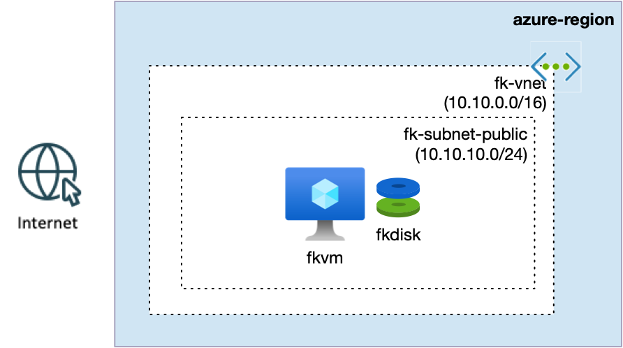
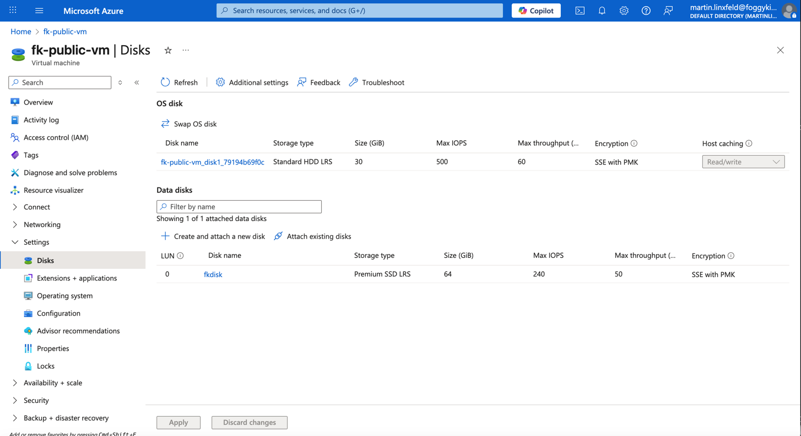

# Example 01: Single Azure Virtual Machine with Managed Data Disk

This example demonstrates how to provision a **single Linux Virtual
Machine** with a **dedicated Azure Managed Data Disk** using **Terraform
/ OpenTofu**.

The purpose of this example is **not** to showcase advanced compute or
networking features. Instead, it focuses on a single concept:

> **Persistent storage in Azure starts with Managed Disks --- not with
> the OS filesystem.**

------------------------------------------------------------------------

## 🧭 Architecture Overview



*Figure 1. Single Azure Virtual Machine deployed into a public subnet with a dedicated Managed Data Disk attached.*

This deployment creates a minimal Azure setup:

-   One **Linux Virtual Machine**
-   One **OS Disk** (managed by Azure as part of the VM)
-   One **Managed Data Disk** attached at **LUN 0**
-   A basic Virtual Network and subnet (for connectivity only)

The data disk is created using the `terraform-az-fk-disk` module and
attached explicitly to the VM.

This example is intentionally simple and **not production-ready**.

------------------------------------------------------------------------

## 🎯 Why this example exists

Before introducing:

-   VM Scale Sets,
-   autoscaling,
-   Load Balancers,
-   or Kubernetes persistent volumes,

it is critical to understand **how Azure handles disk persistence at the
VM level**.

This example teaches:

-   The difference between **OS disks** and **data disks**
-   How Managed Disks exist as **independent Azure resources**
-   Why application data should live on **data disks**, not on the OS
    filesystem
-   How disk attachment is modeled explicitly in Terraform

This is the **storage foundation** for all higher-level Azure compute
patterns.

------------------------------------------------------------------------

## 🚀 Deployment Steps

From the example directory:

``` bash
tofu init
tofu plan
tofu apply
```

After a successful apply, Terraform will output the VM public IP
address.

------------------------------------------------------------------------

## 🖼️ Azure Portal Verification

After deployment, navigate to:

**Virtual Machine → Disks**

You should observe:

-   An **OS disk** attached to the VM
-   A separate **Managed Data Disk**
-   The data disk attached at **LUN 0**
-   Clear separation between OS storage and persistent application
    storage



*Figure 1. Linux Virtual Machine with a dedicated Managed Data Disk
attached using Terraform/OpenTofu.*

------------------------------------------------------------------------

## 🔍 VM-Level Verification (optional)

Connect to the VM using SSH:

``` bash
ssh azureuser@<vm_public_ip>
```

List block devices:

``` bash
lsblk
```

You should see an additional disk device corresponding to the attached
Managed Disk.

This disk is **persistent** and survives VM restarts and re-deployments.

------------------------------------------------------------------------

## 🧹 Cleanup

When finished, remove all resources:

``` bash
tofu destroy
```

------------------------------------------------------------------------

## 🪪 License

Licensed under the **Universal Permissive License (UPL), Version 1.0**.

